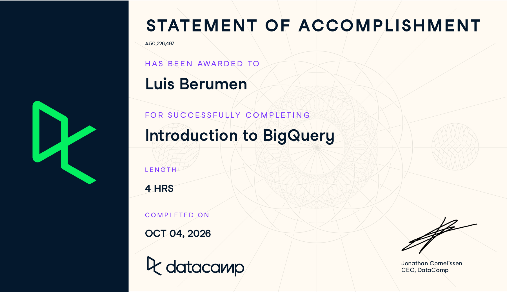
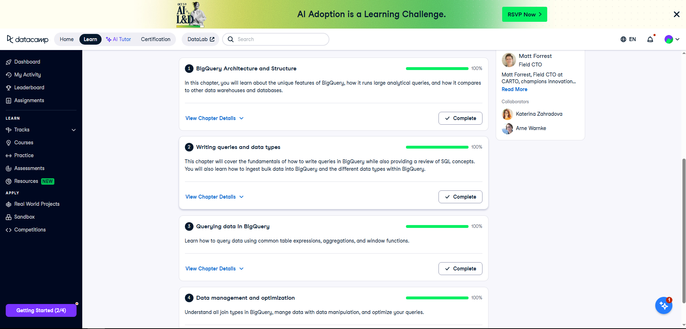

## Course-Completion Evidence

{width="90%"}

{width="100%"}

## BigQuery Architecture and Structure

### Main ideas

In this chapter, I learned that BigQuery is a cloud data warehouse used to analyze large amounts of information. SQL is the language I use to ask questions, while BigQuery provides the system that stores and processes the data. Its storage and computing resources are separate, and its column-based storage supports analytical queries that summarize selected fields across many records. This helps me understand why choosing only the columns I need matters. BigQuery manages the infrastructure, but I still have to organize the data and write useful queries.

### BigQuery terminology and procedures

A **project** is the Google Cloud container associated with resources, permissions, and billing. A **dataset** organizes tables and views within a project. A **table** contains records, and its **schema** defines the column names and data types. A **query job** is the work BigQuery performs when I run a query. A **view** stores a query definition that can be reused.

For a first inspection, I would open BigQuery in the Google Cloud console, locate the project and dataset in Explorer, select a table, and review its Schema, Details, and Preview tabs. Before running SQL, I would check that I have access to the correct table and review the estimated bytes processed when available. The Preview tab is useful for inspecting records without writing a full-table query. I would also check whether the table is partitioned and what one row represents.

### Important SQL syntax and example

Fully qualified table names follow `project.dataset.table`. Backticks keep the complete table identifier together, including a project name with hyphens.

``` sql
-- Illustrative CEP schema; replace these names with approved resources.
SELECT opportunity_id, owner_id, updated_at
FROM `example-project.crm_analytics.opportunities`
LIMIT 10;
```

**What the example does.** This query previews three fields from up to ten opportunity records. `example-project` represents a Google Cloud project, `crm_analytics` represents a dataset, and `opportunities` represents a hypothetical approved Salesforce extract. `opportunity_id` identifies an opportunity, `owner_id` is a deidentified sales-user key, and `updated_at` is its last recorded update timestamp. These names are examples rather than actual CVRx resources. `LIMIT` keeps the displayed result small; it does not guarantee lower bytes scanned.

### CEP application

Our group CEP focuses on meaningful Salesforce adoption at CVRx. My part proposes a Salesforce Adoption Index using timely updates, record completeness, interaction documentation, and workflow consistency. If CVRx approves the data and cloud environment, a dataset could organize the extracts used to calculate those measures. Checking the schema and row definition first would help me avoid confusing a user, an opportunity, and an interaction. BigQuery is a possible analysis tool for the project; this report does not mean that CVRx has approved its use or supplied these tables.

## Writing queries and data types

### Main ideas

This chapter helped me connect basic SQL to the types of data BigQuery can store. A query can run correctly only when its operations make sense for the fields involved. For example, a purchase timestamp is different from a text description of a date. I also learned that BigQuery can store related information inside a record using arrays and structures, rather than always separating every detail into another table.

### BigQuery terminology and procedures

`STRING` stores text, `INT64` stores whole numbers, `FLOAT64` stores approximate decimal values, and `NUMERIC` supports exact decimal values within its precision limits. `BOOL` stores true or false. `DATE` stores a calendar date, while `TIMESTAMP` represents an absolute point in time. `STRUCT` groups named fields, and `ARRAY` stores a list of values of the same type. `NULL` means missing or unknown information, so I use `IS NULL` rather than `= NULL`.

To load a file, I would select the target dataset, choose Create table, select the source and file format, enter the destination table name, and review the schema. For an approved CSV extract, I would check headers, delimiters, column types, and missing values before creating the table. After loading, I would compare row counts and inspect a sample to check that IDs and timestamps were interpreted correctly. Schema auto-detection is a starting point that still needs review.

### Important SQL syntax and examples

Useful patterns include `SELECT`, `FROM`, `WHERE`, `CAST`, `SAFE_CAST`, `IS NULL`, `ARRAY_LENGTH`, and `UNNEST`. `SAFE_CAST` returns `NULL` when a supported conversion fails for a particular value, which helps flag problematic source records.

``` sql
-- Course example: show orders that are at least 90 days old.
SELECT order_id, order_purchase_timestamp
FROM ecommerce.ecomm_order_details
WHERE order_purchase_timestamp <=
      TIMESTAMP_SUB(CURRENT_TIMESTAMP(), INTERVAL 90 DAY);
```

**What the example does.** This uses the DataCamp practice table to find orders purchased on or before the timestamp 90 days before the query runs. `order_id` identifies the order, and `order_purchase_timestamp` contains its purchase time. The comparison returns older orders; a recent-90-days filter would instead use `>=`. I would keep that distinction in my notes because changing the comparison changes the question being answered.

``` sql
-- Course example: expand an order's repeated item records.
SELECT o.order_id, item.product_id, item.price
FROM ecommerce.ecomm_orders AS o
CROSS JOIN UNNEST(o.order_items) AS item;
```

**What the second example does.** `order_items` is an array of item structures in the course data. `UNNEST` turns each item into a result row, and dot notation retrieves its product ID and price. One order can therefore appear several times. Empty or null arrays produce no rows with this cross join, so this pattern is appropriate when I specifically want item records. I would use a left join pattern if I needed to retain orders without items.

### CEP application

For the proposed adoption measures, timestamps could help identify stale records and `NULL` checks could help measure completeness. A missing field is not automatically proof of low adoption: I would first establish whether that field is required for the specific record or workflow. If an approved extract contains repeated interactions, I would check the effect of `UNNEST` on row counts before calculating a user-level measure. Deidentified keys and suitable data types would make the later comparisons more reliable.

## Querying data in BigQuery

### Main ideas

This chapter showed me how to turn individual records into summaries. Aggregation reduces rows into groups, a common table expression makes a query easier to follow, and a window function calculates across related rows while preserving the rows in the result. The difference matters because a monthly summary and a list of individual users with rankings answer different questions.

### BigQuery terminology and procedures

`GROUP BY` defines the groups for aggregate functions such as `COUNT`, `SUM`, and `AVG`. `WHERE` filters input rows, while `HAVING` filters grouped results. A **common table expression**, introduced with `WITH`, names an intermediate query result. A **window function** uses `OVER` with a partition and optional ordering. I would decide the intended level of detail before writing the query, then check that the final grouping matches it. A CTE improves readability but is not automatically a stored table or a performance improvement.

### Important SQL syntax and examples

``` sql
-- Hypothetical approved extract: count opportunities updated by month.
WITH monthly_activity AS (
  SELECT
    owner_id,
    DATE_TRUNC(DATE(updated_at, 'America/Los_Angeles'), MONTH) AS month,
    COUNT(DISTINCT opportunity_id) AS updated_opportunities
  FROM `example-project.crm_analytics.opportunities`
  WHERE owner_id IS NOT NULL AND updated_at IS NOT NULL
  GROUP BY owner_id, month
)
SELECT
  owner_id,
  month,
  updated_opportunities,
  DENSE_RANK() OVER (
    PARTITION BY month
    ORDER BY updated_opportunities DESC
  ) AS activity_rank
FROM monthly_activity
ORDER BY month, activity_rank, owner_id;
```

**What the example does.** The CTE counts distinct opportunities by owner and by the month of the stored update timestamp. The explicit time zone determines the local month boundary. The window function then ranks those counts within each month; equal counts receive the same rank. `COUNT(DISTINCT ...)` prevents repeated opportunity IDs within a group from inflating that count. The table and fields are the illustrative names defined in the first chapter.

This example assumes an opportunity snapshot containing its latest update. It cannot reconstruct every historical update: a record appears in the month of the timestamp available in the extract. An audit or activity-history table would be needed to measure all updates over time. This distinction would matter before presenting a trend to the CEP group.

``` sql
-- Course example: summarize product weights by category.
SELECT
  product_category_name_english,
  AVG(product_weight_g) AS avg_weight_g
FROM ecommerce.ecomm_products
GROUP BY product_category_name_english
HAVING AVG(product_weight_g) > 1000;
```

**What the second example does.** This calculates average product weight for each category in the practice data, then retains categories whose average exceeds 1,000 grams. `HAVING` applies to the category summary rather than filtering individual heavy products before computing the average. `AVG` ignores null weights, so I would also check how many records have a usable weight.

### CEP application

Monthly summaries could help our group compare patterns across roles, territories, and time periods. CTEs could keep the individual steps of the proposed Adoption Index understandable before combining the measures. However, an activity rank is not an adoption score. Users have different workloads and responsibilities, so the final index would need approved definitions, appropriate denominators, and agreed weights. These summaries could also support our group's work on adoption barriers, user segments, and the evaluation of targeted engagement efforts.

## Data management and optimization

### Main ideas

In the last chapter, I learned that getting a correct result and getting an efficient result are related responsibilities. Joins connect tables, but repeated keys can multiply rows. Data manipulation statements can change stored records, while ordinary `SELECT` queries only retrieve them. Query optimization means reducing unnecessary work while preserving the meaning of the analysis.

### BigQuery terminology and procedures

An `INNER JOIN` keeps matching records, while a `LEFT JOIN` retains all records from the left table and adds matches from the right. `USING (order_id)` joins tables through a field with the same name; `ON` supports explicit matching conditions. `INSERT`, `UPDATE`, `DELETE`, and `MERGE` modify data. Before a modification, I would first run a `SELECT` with the intended filter and inspect the affected records in a controlled working table.

For efficient analysis, I would select needed columns, filter relevant records, inspect join keys, and review estimated bytes processed. **Partitioning** separates data into partitions, often by date; an appropriate partition filter can reduce the data scanned. **Clustering** organizes storage by selected fields and can help relevant filters skip blocks. Approximate aggregates can use fewer resources when an estimate is acceptable. I would use exact counts for a final result that requires an exact denominator.

### Important SQL syntax and examples

``` sql
-- Course example: summarize payment plans and value per installment.
SELECT
  p.payment_installments,
  APPROX_COUNT_DISTINCT(p.order_id) AS approximate_orders,
  -- Calculate the average payment per installment.
  AVG(p.payment_value) / p.payment_installments AS avg_installment_value
FROM ecommerce.ecomm_payments AS p
JOIN ecommerce.ecomm_order_details AS o USING (order_id)
WHERE p.payment_installments > 0
GROUP BY p.payment_installments;
```

**What the example does.** This groups payment records by installment count, estimates distinct orders, and calculates the average payment amount divided by that group's installment count. The filter excludes zero installments and prevents division by zero. `APPROX_COUNT_DISTINCT` estimates unique order IDs rather than counting every payment row. This is an order estimate, not a distinct-customer count, and the example does not apply a date filter. I would check that the order-details table has one matching record per order because duplicated join keys could distort the average.

``` sql
-- Extension: restrict the same practice tables to the last 90 days.
SELECT
  p.payment_installments,
  APPROX_COUNT_DISTINCT(p.order_id) AS approximate_orders,
  AVG(p.payment_value) / p.payment_installments AS avg_installment_value
FROM ecommerce.ecomm_payments AS p
JOIN ecommerce.ecomm_order_details AS o USING (order_id)
WHERE p.payment_installments > 0
  AND o.order_purchase_timestamp >=
      TIMESTAMP_SUB(CURRENT_TIMESTAMP(), INTERVAL 90 DAY)
  AND o.order_purchase_timestamp <= CURRENT_TIMESTAMP()
GROUP BY p.payment_installments;
```

**What the extension does.** This adds a lower timestamp boundary and excludes future purchases. It answers the recent-90-days question rather than the older-orders question from the earlier chapter. A timestamp filter helps define the requested records, but its scan savings depend on how the table is stored and partitioned.

### CEP application

Joins could connect approved opportunity records with deidentified user attributes or documented interactions. I would confirm the relationship between tables before combining them so one opportunity is not accidentally counted several times. For CVRx, a recent-period filter could help define a consistent observation window for the adoption measures. Selecting only approved, necessary fields would also keep the analysis focused. Approximate counts could support exploratory work, while final Adoption Index calculations would use the precision and definitions agreed with the project team.

## Overall Reflection and Future Reference

The most useful concepts for me were the project-dataset-table structure, the difference between aggregation and window functions, and checking what a join does to the number of records. These concepts give me a way to move from simply selecting rows to preparing information that could support a dashboard or repeated analysis.

Using BigQuery is different from learning SQL syntax alone because I also have to think about where the data is stored, who can access it, how it is loaded, and how much work the query performs. A query that runs successfully is not enough if I chose the wrong date window or changed the level of detail without noticing. The parts I would review most are arrays with `UNNEST`, grouping with `HAVING`, and the direction of timestamp comparisons. The exercises helped me see why a small syntax change can change the meaning of the output.

For digital marketing, similar patterns could summarize campaign activity, customer purchases, survey responses, or approved GA4 event data. For our CVRx CEP, the immediate value would be organizing approved Salesforce extracts and developing reproducible measures of meaningful adoption. I would not treat login activity or raw record counts as the full definition of adoption. The index would need to reflect useful behavior, workload, and required workflows before our group could evaluate an intervention.

The patterns I expect to revisit are fully qualified table names, `SAFE_CAST`, `UNNEST`, `WITH`, `GROUP BY`, `HAVING`, window functions, joins, and `TIMESTAMP_SUB`. Before reusing them, I would check the schema, intended row level, time zone, duplicate keys, and missing values. The examples here are reference queries, not reported results from confidential CVRx data.

## Appendix: Publication Links

- [GitHub Repository](https://github.com/Brahhmen55/ibm-6500-sql-learning-portfolio)
- [Published Introduction to BigQuery Report](https://brahhmen55.github.io/ibm-6500-sql-learning-portfolio/introduction-to-bigquery/)
