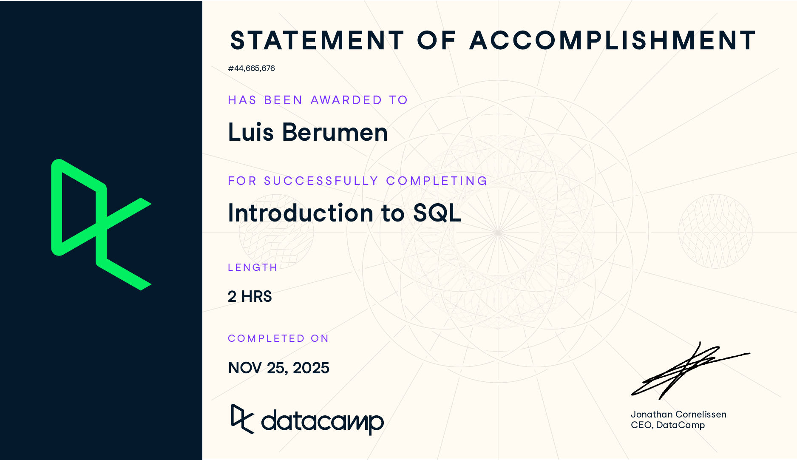
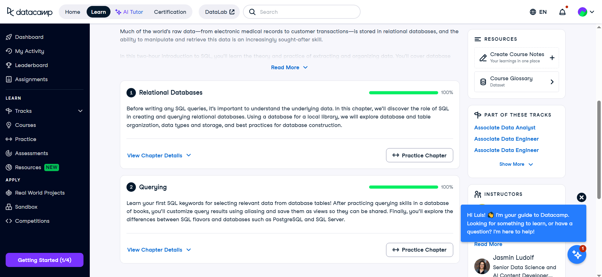

## Course-Completion Evidence

I completed DataCamp's *Introduction to SQL* course on November 25, 2025, as shown in the statement of accomplishment below. I also redid the assignment within the course page but the certificate was not updated regarding the date.

{fig-alt="DataCamp statement of accomplishment for Luis Berumen, Introduction to SQL, completed November 25, 2025" width="90%"}

The additional course-page screenshot below shows 100% progress for the two visible chapters, Relational Databases and Querying.

{fig-alt="DataCamp course page showing 100% progress for the two visible chapters" width="90%"}

## Relational Databases

**Main ideas.** In this first chapter, I learned that a relational database organizes information into tables. Each row is a record and each column is a field. A database can hold separate tables for different parts of a business, such as sales users, opportunities, and customer interactions, instead of putting everything into one spreadsheet. A unique identifier, such as `opportunity_id`, helps distinguish one record from another. Fields also need suitable data types: text for names, whole numbers for counts, and dates for updates. Choosing useful names and types at the beginning makes the database easier to understand and use later.

**Important SQL syntax.** This chapter introduced the structure of tables and showed a first look at `SELECT *` and `FROM` to inspect a table. The asterisk means all fields. The example assumes a hypothetical `opportunities` table.

``` sql
SELECT *
FROM opportunities;
```

**What the example does.** This query displays every field and record from a hypothetical `opportunities` table. I would expect a unique `opportunity_id` and, if CVRx approves those fields for analysis, an owner identifier and an update date. This would let me inspect the structure before deciding which fields are appropriate for my Salesforce Adoption Index. It does not change the data or create a table.

**CEP application.** Our group CEP project is about improving meaningful Salesforce adoption at CVRx. My part is to propose a Salesforce Adoption Index using measures such as timely opportunity updates, record completeness, customer-interaction documentation, and workflow consistency. Organizing the approved data into related tables could help connect a sales user with the opportunities and interactions relevant to that person. A unique ID would matter because I would need reliable records before comparing adoption across roles, territories, or months. The actual fields, access, and scoring rules still need to be agreed with CVRx.

## Querying

**Main ideas.** The second chapter showed me how SQL retrieves information from a table without changing the original records. `SELECT` chooses the fields I want to see, and `FROM` tells SQL where to find them. I can use `DISTINCT` when I only want unique values, `AS` to give a result column a clearer label, and `LIMIT` to preview a small number of records. A view saves a query so it can be used again. I also learned that SQL systems such as PostgreSQL and SQL Server have a lot in common, but certain commands vary by system.

**Important SQL syntax.** `SELECT`, `FROM`, `DISTINCT`, `AS`, `LIMIT`, and `CREATE VIEW` are useful starting points for retrieving, labeling, and saving results. The examples below use PostgreSQL-style `LIMIT`; SQL Server uses different syntax to limit rows.

``` sql
SELECT DISTINCT owner_id AS sales_user_id
FROM opportunities
LIMIT 10;
```

**What the example does.** Assuming the approved opportunity data has an `owner_id` field, this query previews up to ten unique owner IDs and labels the result `sales_user_id`. `DISTINCT` removes repeated IDs from this preview. `LIMIT 10` does not rank users by activity or measure adoption. It would only help me check whether the owner field is available and consistently populated before doing a more detailed analysis.

``` sql
CREATE VIEW opportunity_owner_list AS
SELECT DISTINCT owner_id
FROM opportunities;
```

**What the second example does.** This saves the query as a view called `opportunity_owner_list`. I could use it again to review which owner IDs appear in the approved opportunity data without rewriting the `SELECT` statement. The view stores the query definition rather than a separate copy of the opportunity records.

**CEP application.** For CVRx, these basic queries could help me inspect which sales users appear in an approved Salesforce extract before building the proposed adoption measures. The next step would be to check dates, required fields, and the amount of work assigned to each user so that a person with fewer active opportunities is not treated as a low adopter just because they had less to enter. That analysis would need additional SQL skills beyond this introductory course. It would give our group a baseline before designing and evaluating a targeted field engagement campaign.

## Overall Reflection and Future Reference

The most useful skill I learned was how to think about data as organized records in related tables and how to retrieve only the fields needed to answer a question. Before this course, it was easier for me to think of data as a large spreadsheet. Now I can see how a database could make repeated analysis more manageable, especially when our CVRx project could involve opportunity records, customer interactions, and field-user activity in different places.

The part I would need to practice most is deciding how to organize tables and choose a unique identifier. If the IDs or data types are inconsistent, a query might still run but give me results that are hard to trust. I would also review the differences between SQL flavors before moving a query between PostgreSQL, SQL Server, or BigQuery. For the CVRx CEP, I expect SQL to help prepare approved Salesforce information for the Adoption Index, compare patterns across roles or time periods, and eventually show the results in a dashboard. The commands I will probably return to first are `SELECT`, `FROM`, `DISTINCT`, `AS`, and `CREATE VIEW` because they help turn stored data into a usable reference for further analysis.

## Appendix: Publication Links

- [GitHub Repository](https://github.com/Brahhmen55/ibm-6500-sql-learning-portfolio)
- [Published Introduction to SQL Report](https://Brahhmen55/ibm-6500-sql-learning-portfolio/introduction-to-sql.html)
